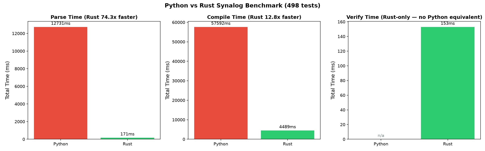
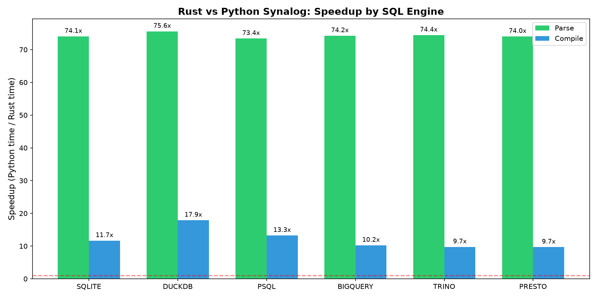
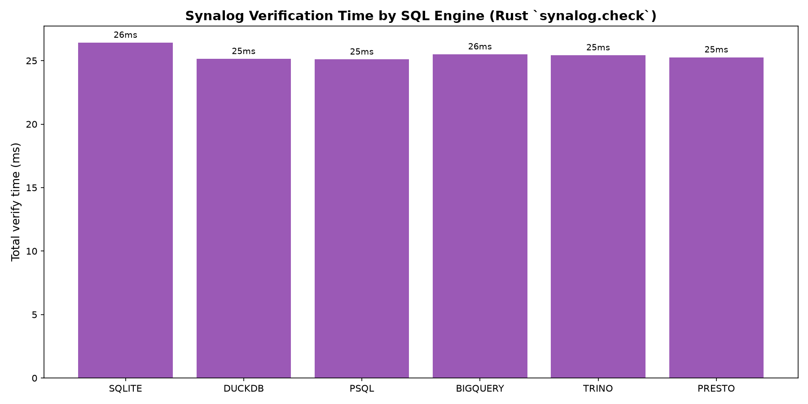
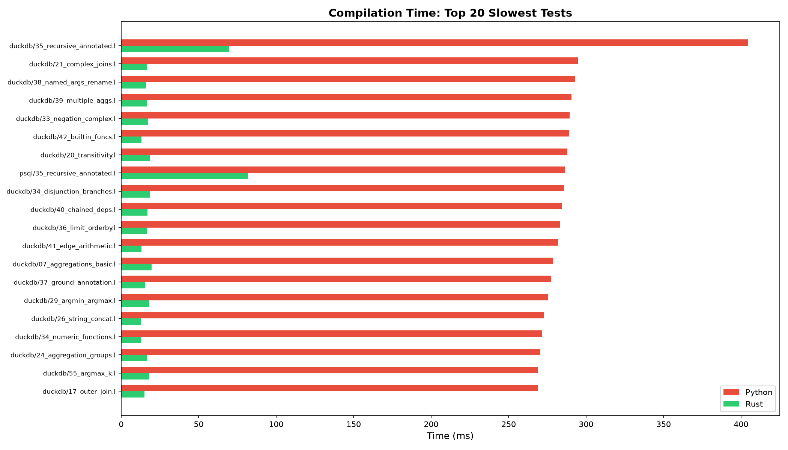
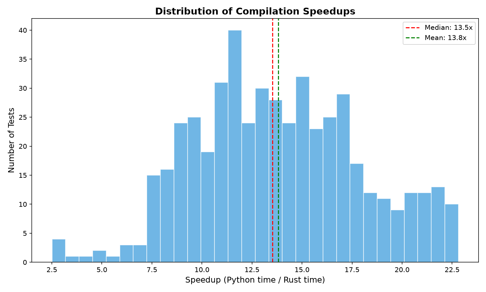

# Benchmark

Synalog is a fork of [Logica](https://logica.dev/) with the parser and compiler rewritten in Rust. This page tracks how the Rust core compares with the original Python implementation: every program of the [compiler test suite](development.md) is parsed and compiled with both, per engine, and the timings are averaged over several runs.

Both implementations run **in-process** — Synalog through the same PyO3 extension that `pip install synalog` ships, Logica through its Python modules — so the comparison measures exactly what a Python caller gets, with no process-startup overhead on either side.

## Results

--8<-- "docs/benchmark/summary.md"

Parsing is dominated by the grammar work and speeds up uniformly across engines. Compilation includes SQL generation, so the speedup varies with how much dialect-specific rewriting each engine needs.

Synalog also runs a dedicated **verification** pass (`synalog.check` — safety, stratification, recursion and reserved-name checks) before compiling. Python Logica folds the same analysis into compilation and exposes no standalone equivalent, so verification is timed on the Rust side only and reported as an absolute total rather than a speedup.

## Plots











## Reproducing

The benchmark needs the `synalog` wheel and the Python `logica` package installed (`pip install synalog logica`, or `maturin develop --release` for the local crate):

```bash
python3 benchmark.py          # run everything, write docs/benchmark/
python3 plot_benchmark.py     # regenerate the plots
```

Raw timings are stored in [`docs/benchmark/results.json`](benchmark/results.json), and the tables above come from the generated `docs/benchmark/summary.md` — both are rewritten on every run, so this page always shows the latest results.
