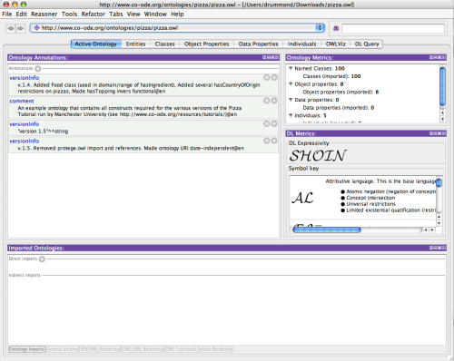
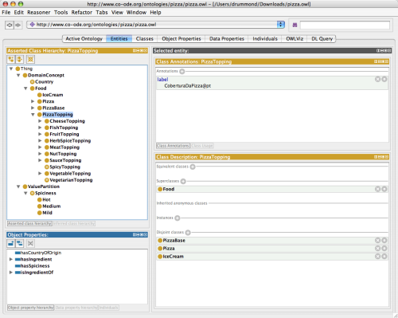

# Ontologies

An **ontology** is a formal model of a domain: the *classes* of things that exist, the *properties* that describe and relate them, and (optionally) the *individuals* — the actual instances. The web standard for ontologies is [OWL](https://www.w3.org/OWL/), built on [RDF](https://www.w3.org/RDF/); an ontology is just a set of RDF triples and can be serialized as RDF/XML (`.owl`), Turtle (`.ttl`), N-Triples, JSON-LD, and more.

Ontologies map almost one-to-one onto Synalog's [knowledge-graph conventions](knowledge-graphs.md): a class is a node, a relationship is an edge, an individual is a fact. `synalog import` does that translation for you, so an ontology someone already modeled — yours, a domain standard, or one downloaded from the web — becomes a runnable Synalog program with no hand-writing.

## Importing an ontology

`synalog import` reads any RDF serialization [rdflib](https://rdflib.dev/) understands (`.owl`, `.ttl`, `.rdf`, `.n3`, JSON-LD), from a local file **or an `http(s)`/`ftp` URL**, and writes a Synalog program to stdout — redirect it into a `.l` file:

```bash
synalog import ontology.ttl > ontology.l                  # local file
synalog import https://example.org/onto.owl > onto.l      # downloaded
```

The output has two layers, so the command works whether an ontology is mostly a **schema** (lots of classes, few or no individuals — a taxonomy like the [OBO](https://obofoundry.org/) biomedical ontologies) or mostly **data** (rich in individuals — FOAF, the HR model below):

**Schema layer** (always emitted — the TBox):

| Ontology construct | Synalog output |
| --- | --- |
| Class | a row of `Class` (keyed by the class URI, with a `label` from `rdfs:label`) |
| `rdfs:subClassOf` | a recursive `SubClassOf` — the transitive closure of the hierarchy |

**Instance layer** (emitted for each class that actually has individuals — the ABox):

| Ontology construct | Synalog output |
| --- | --- |
| Class with individuals | a concept (named after the class) keyed by the individual's URI (preserved verbatim) |
| Datatype property | a column on the concept of every individual that uses it |
| Object property | a concept (named after the property) joining two entities through their URIs |
| Individual | a `*Raw` fact the concepts build on, so the program runs as-is |

**OWL property axioms and characteristics** are translated to the matching rule patterns — so a transitive property is actually *closed*, an inverse is actually *derived*, and a functional property is actually *checked*. Rather than tabulate them, [Every OWL axiom, by example](#every-owl-axiom-by-example) below shows each construct end-to-end: the OWL declaration and the exact Synalog `import` generates from it.

Characteristics propagate across `owl:inverseOf` and `owl:equivalentProperty` (the inverse of a transitive property is transitive, of a functional one is inverse-functional; equivalents share everything), so the closures are complete on both sides. Every generated program is validated by the verifier. `owl:complementOf` and `owl:propertyChainAxiom` are not translated — they need open-world / non-stratifiable reasoning that does not map to a finite SQL rule.

Emitting per-class entity concepts only for classes that have individuals is what keeps a class-centric ontology usable: a 15,000-class taxonomy with no individuals becomes a single `Class` plus its `SubClassOf` hierarchy, not 15,000 empty one-row predicates.

Datatype columns are **data-driven**: a property becomes a column of a concept when an individual of that class actually uses it. That means inheritance works without reasoning over the class hierarchy — an individual typed as a subclass still gets the superclass's properties — and properties with no declared `rdfs:domain` are picked up too. Values keep their natural type (numbers, booleans) where rdflib can infer it; strings are emitted as single-quoted literals, and a property an individual lacks is filled with `null` so every row of a concept has the same shape.

## Building an ontology with Protégé

[Protégé](https://protege.stanford.edu/) is the standard free, open-source ontology editor from Stanford. It's the easiest way to author an ontology by hand and export a file `synalog import` can read.

1. **Install and create.** Download the desktop app from [protege.stanford.edu](https://protege.stanford.edu/), then *File → New*. On the **Active Ontology** tab, set the *Ontology IRI* to a base IRI for your domain (e.g. `http://example.org/hr#`); every term you create lives under it, and these IRIs become the `uri` values in the generated program.

    

2. **Classes** (the *Classes* / *Entities* tab) — add a class per kind of entity (`Person`, `Company`, …). Nest a class under another to create an `rdfs:subClassOf` relationship (`Employee` under `Person`); Synalog turns the hierarchy into `SubClassOf`. In the screenshot below the class hierarchy is on the left and the selected class's superclasses are in *Class Description* on the right.

    

3. **Datatype properties** (*Data properties* tab) — add the attributes (`name`, `email`, `salary`). Set each property's **Domain** to the class it describes and its **Range** to a datatype (`xsd:string`, `xsd:integer`, …). These become node columns.
4. **Object properties** (*Object properties* tab) — add the relationships (`worksAt`, `reportsTo`, `knows`). Set **Domain** and **Range** to the connected classes; these become relationship concepts that join through the two classes.
5. **Individuals** (*Individuals* tab, optional) — add instances, assign each a *Type* (its class), and fill in property values. These become the `*Raw` facts, so the imported program runs immediately. Skip this step to import a schema-only ontology (the concepts are still generated, just without data).
6. **Export.** *File → Save as…* and choose **RDF/XML** (`.owl`) or **Turtle** (`.ttl`) — `synalog import` reads either. Then:

    ```bash
    synalog import my-ontology.owl > my-ontology.l
    synalog my-ontology.l check        # validate
    synalog my-ontology.l run Person
    ```

!!! tip "Don't build from scratch when a standard exists"
    Many domains already have a public ontology (schema.org, FOAF, SKOS, the [OBO](https://obofoundry.org/) biomedical ontologies, Wikidata, …). Point `synalog import` straight at its URL, or open it in Protégé to adapt it before importing.

*Screenshots from the [Protégé "Getting Started" guide](https://protegewiki.stanford.edu/wiki/Protege4GettingStarted) (Stanford Center for Biomedical Informatics Research), using the example Pizza ontology.*

## Worked example

This small HR ontology (Turtle) has three levels of classes, a few datatype and object properties, and four individuals:

```turtle
--8<-- "docs/examples/ontology.ttl"
```

??? note "The same ontology as RDF/XML (`ontology.owl`)"

    The serialization doesn't matter — `synalog import ontology.owl` converts this RDF/XML form (the default Protégé export) to exactly the same program.

    ```xml
    --8<-- "docs/examples/ontology.owl"
    ```

`synalog import ontology.ttl` produces the program below. Note how `Employee` and `Manager` carry `name`/`email` even though those properties are declared on `Person` — the columns follow the data:

```logica
--8<-- "docs/examples/ontology.l"
```

??? example "Generated SQL and execution results"

    ```text
    --8<-- "docs/examples/ontology.log"
    ```

## Every OWL axiom, by example

The HR ontology above stays deliberately simple. This second one is the opposite: it packs **every** OWL axiom and property characteristic `import` translates into a single file, so you can read the exact Synalog each produces. A few assertions are intentionally inconsistent (flagged inline) so the generated `*Violation` concepts return rows:

```turtle
--8<-- "docs/examples/axioms.ttl"
```

`synalog import axioms.ttl` turns it into the program below; the rest of this section walks through it construct by construct.

```logica
--8<-- "docs/examples/axioms.l"
```

### Class axioms

`rdfs:subClassOf` and `owl:equivalentClass` both feed one recursive `SubClassOf` — an equivalence is just subclassing both ways (`Human` ⊑ `Person` **and** `Person` ⊑ `Human`):

```turtle
:Person a owl:Class ; rdfs:subClassOf :Agent .
:Human  a owl:Class ; owl:equivalentClass :Person .
```

```logica
@Recursive(SubClassOf, 100);
SubClassOf(child_uri:, parent_uri:) distinct :- SubClassOfRaw(child_uri:, parent_uri:), Class(uri: child_uri), Class(uri: parent_uri);
SubClassOf(child_uri:, parent_uri:) distinct :- SubClassOf(child_uri:, parent_uri: mid), SubClassOfRaw(child_uri: mid, parent_uri:);
SubClassOfRaw(child_uri: 'http://example.org/co#Person', parent_uri: 'http://example.org/co#Agent');
SubClassOfRaw(child_uri: 'http://example.org/co#Human', parent_uri: 'http://example.org/co#Person');
SubClassOfRaw(child_uri: 'http://example.org/co#Person', parent_uri: 'http://example.org/co#Human');
```

`owl:disjointWith` becomes a check — an individual that lands in both classes is a contradiction. `:dave` is typed as both, so the concept returns him:

```turtle
:Employee owl:disjointWith :Contractor .
:dave a :Employee, :Contractor .
```

```logica
@OrderBy(DisjointWithViolation, "uri");
DisjointWithViolation(uri:, class_a:, class_b:) distinct :-
  Contractor(uri:), Employee(uri:), class_a == 'http://example.org/co#Contractor', class_b == 'http://example.org/co#Employee';
```

### Property characteristics

**`owl:TransitiveProperty`** — a one-step `…Step` predicate plus its `@Recursive` closure, so `alice ancestorOf bob` and `bob ancestorOf carol` entail `alice ancestorOf carol`:

```turtle
:ancestorOf a owl:ObjectProperty, owl:TransitiveProperty ; rdfs:domain :Person ; rdfs:range :Person .
```

```logica
AncestorOfStep(subject_uri:, object_uri:) distinct :-
  AncestorOfRaw(subject_uri:, object_uri:), Person(uri: subject_uri), Person(uri: object_uri);
@Recursive(AncestorOf, 100);
AncestorOf(subject_uri:, object_uri:) distinct :- AncestorOfStep(subject_uri:, object_uri:);
AncestorOf(subject_uri:, object_uri:) distinct :- AncestorOf(subject_uri:, object_uri: mid), AncestorOfStep(subject_uri: mid, object_uri:);
```

**`owl:SymmetricProperty`** — the reverse direction is unioned in, so the single asserted `alice knows bob` yields both directions:

```logica
Knows(subject_uri:, object_uri:) distinct :-
  KnowsRaw(subject_uri:, object_uri:), Person(uri: subject_uri), Person(uri: object_uri) |
  KnowsRaw(subject_uri: object_uri, object_uri: subject_uri), Person(uri: subject_uri), Person(uri: object_uri);
```

**`owl:ReflexiveProperty`** — `(x, x)` for every individual in the domain:

```logica
SameTeamAs(subject_uri:, object_uri:) distinct :- Person(uri: subject_uri), object_uri == subject_uri;
```

**`owl:FunctionalProperty` / `owl:InverseFunctionalProperty`** — a check for a subject (resp. object) that appears with two different values. `:alice` has two desks, so the functional check flags her:

```turtle
:hasDesk a owl:ObjectProperty, owl:FunctionalProperty, owl:InverseFunctionalProperty ;
         rdfs:domain :Person ; rdfs:range :Desk .
```

```logica
HasDeskFunctionalViolation(subject_uri:) distinct :- HasDesk(subject_uri:, object_uri: value_a), HasDesk(subject_uri:, object_uri: value_b), value_a != value_b;
HasDeskInverseFunctionalViolation(object_uri:) distinct :- HasDesk(subject_uri: subject_a, object_uri:), HasDesk(subject_uri: subject_b, object_uri:), subject_a != subject_b;
```

**`owl:AsymmetricProperty` / `owl:IrreflexiveProperty`** — a check for a pair that holds both ways (resp. a self-loop). `:alice` and `:bob` supervise each other and `:carol` supervises herself, so both fire:

```turtle
:supervises a owl:ObjectProperty, owl:AsymmetricProperty, owl:IrreflexiveProperty ;
            rdfs:domain :Person ; rdfs:range :Person .
```

```logica
SupervisesAsymmetricViolation(subject_uri:, object_uri:) distinct :- Supervises(subject_uri:, object_uri:), Supervises(subject_uri: object_uri, object_uri: subject_uri);
SupervisesIrreflexiveViolation(uri:) distinct :- Supervises(subject_uri: uri, object_uri: uri);
```

### Relations between properties

**`owl:inverseOf`** — `employs` derives its rows by swapping the subject and object of `worksAt`'s facts:

```turtle
:employs a owl:ObjectProperty ; owl:inverseOf :worksAt .
```

```logica
Employs(subject_uri:, object_uri:) distinct :- WorksAtRaw(subject_uri: object_uri, object_uri: subject_uri);
```

**`rdfs:subPropertyOf`** — `fatherOf`'s facts flow up into `parentOf`:

```turtle
:fatherOf a owl:ObjectProperty ; rdfs:subPropertyOf :parentOf .
```

```logica
ParentOf(subject_uri:, object_uri:) distinct :- FatherOfRaw(subject_uri:, object_uri:), Person(uri: subject_uri), Person(uri: object_uri);
```

**`owl:equivalentProperty`** — `acquaintedWith` includes `knows`'s facts:

```turtle
:acquaintedWith a owl:ObjectProperty ; owl:equivalentProperty :knows .
```

```logica
AcquaintedWith(subject_uri:, object_uri:) distinct :- KnowsRaw(subject_uri:, object_uri:);
```

### Individual axioms

**`owl:sameAs`** — a symmetric, transitive `SameAs` concept (the same closure shape as a transitive property):

```logica
@Recursive(SameAs, 100);
SameAs(left_uri:, right_uri:) distinct :-
  SameAsRaw(left_uri:, right_uri:) |
  SameAsRaw(left_uri: right_uri, right_uri: left_uri);
SameAs(left_uri:, right_uri:) distinct :- SameAs(left_uri:, right_uri: mid), SameAs(left_uri: mid, right_uri:);
```

**`owl:differentFrom`** — a check: two individuals asserted different yet inferred `SameAs` are inconsistent (none are, here):

```logica
DifferentFromViolation(left_uri:, right_uri:) distinct :- SameAs(left_uri:, right_uri:), DifferentFromRaw(left_uri:, right_uri:);
```

Running the headline predicates shows the closures filled in and the `*Violation` checks firing on the inconsistent rows:

??? example "Generated SQL and execution results"

    ```text
    --8<-- "docs/examples/axioms.log"
    ```

## Large, real-world ontologies

The two-layer mapping shines on the big public ontologies, which are almost entirely schema. The [Human Disease Ontology](https://disease-ontology.org/) (DOID) is a good stress test — point `import` straight at its URL:

```bash
synalog import https://purl.obolibrary.org/obo/doid.owl > doid.l
```

That 28 MB ontology has **14,703 classes**, a **17,224-edge** `subClassOf` hierarchy and **no individuals** — so the output is the schema layer only: one `Class` (every disease, with its `rdfs:label`) and the recursive `SubClassOf`, instead of 14,703 empty per-class predicates. An excerpt:

```text
--8<-- "docs/examples/doid_excerpt.txt"
```

The whole thing converts in a few seconds; from there a recursive query over `SubClassOf` gives you, say, every subtype of a disease by a single ancestor lookup.

## Next steps

From here it's an ordinary Synalog program: add rules that traverse the edges, compose them, or join them with your other tables — see [Knowledge graphs](knowledge-graphs.md).
